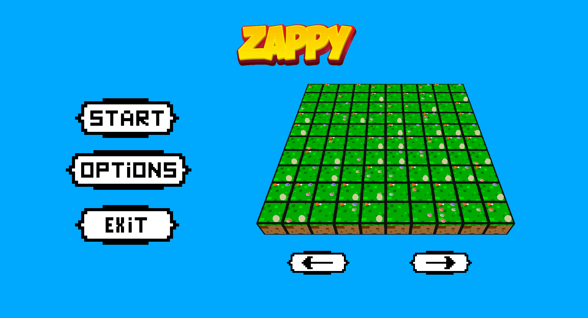
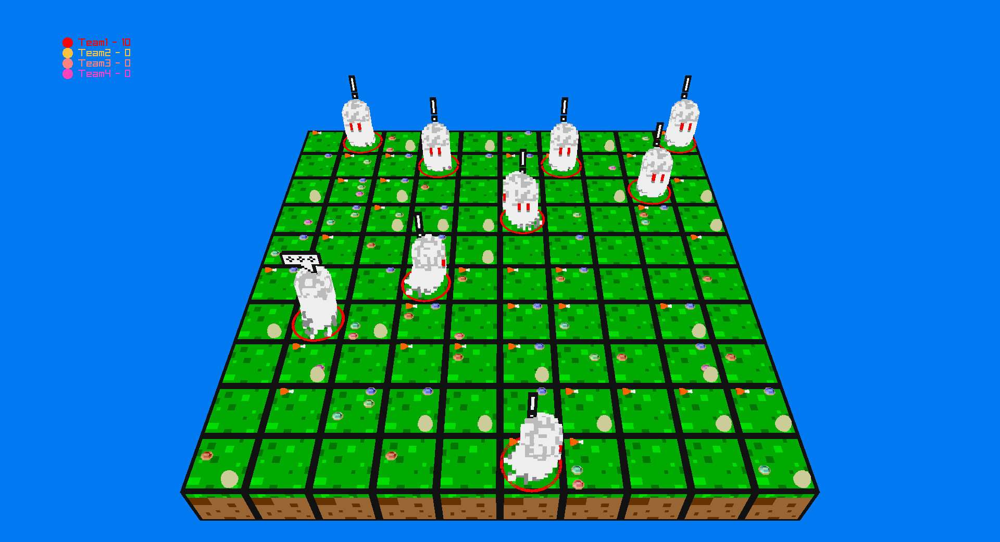

## Subject ##
---

The goal of this project is to create a network game. Several teams confront on a tiles map containing resources. The winning team is the one with an AI that reached the highest level of evolution. To evolve, players must gather resources and must deal with their basic needs (food, elevation requirement) in a circular world. They do this by performing actions that allow them to move, gather resources, and communicate with other AI. All these actions require server communication via a TCP/IP network socket.

## Implementation ##
---

The project is divided into three parts:

-   The server implemented in C, which manages the game logic and the communication between AI and GUI.
-   The AI using C++, which is the player's champion that will evolve on the server and try to achieve the highest level in the lowest time.
-   The GUI implemented in C++ using Raylib, which is a graphical interface that allows you to view the game in real time.

These three parts communicate with each other via a TCP/IP network socket using a protocol defined in the subject.

## Raylib Installation ##
---

Ubuntu : `sudo apt install libasound2-dev mesa-common-dev libx11-dev libxrandr-dev libxi-dev xorg-dev libgl1-mesa-dev libglu1-mesa-dev`

Fedora : `sudo dnf install alsa-lib-devel mesa-libGL-devel libX11-devel libXrandr-devel libXi-devel libXcursor-devel libXinerama-devel libatomic`

`git clone https://github.com/raysan5/raylib.git raylib`

`cd raylib/src/`

`make PLATFORM=PLATFORM_DESKTOP RAYLIB_LIBTYPE=SHARED`

`sudo make install RAYLIB_LIBTYPE=SHARED`

`cd ../..`

`rm -rf raylib`

## Build ##
---

Build the entire project
```bash
make
```

Build the ai part of the project
```bash
make zappy_ai
```

Build the graphical interface part of the project
```bash
make zappy_gui
```

Build the server part of the project
```bash
make zappy_server
```

## Usage 
---

```
USAGE: ./zappy_server -p port -x width -y height -n name1 name2 ... -c clientsNb -f freq
        port            is the port number
        width           is the width of the world
        height          is the height of the world
        nameX           is the name of the team X
        clientsNb       is the number of authorized clients per team
        freq            is the reciprocal of time unit for execution of actions

USAGE: ./zappy_ai -p port -n name -h machine
        port    is the port number
        name    is the name of the team
        machine is the name of the machine; localhost by default

USAGE: ./zappy_gui -p port -h machine
        port    is the port number
        machine is the name of the machine; localhost by default
```

# Basic example ##
---

```bash
./zappy_server -p 4242 -x 15 -y 15 -n Team1 Team2 -c 3 -f 100

./zappy_ai -p 4242 -n Team1 -h 127.0.0.1

./zappy_ai -p 4242 -n Team2

./zappy_gui -p 4242
```

## Main Menu with map selection ##
---


## Game Example ##
---


## Bonus ##
---

### Game Controller ###

We wanted to add a client that was neither a GUI nor an AI but a client on which we can play by ourselves, it was made using CSFML. Every sprites were done using piskel. Once we are connected, the map is displayed in the center of the screen, in the bottom of the screen, you can see the inventory hotbar, on the right, there is the action-related buttons. The inventory and the map are refreshed respectively for every call to "Inventory" of "Look".
